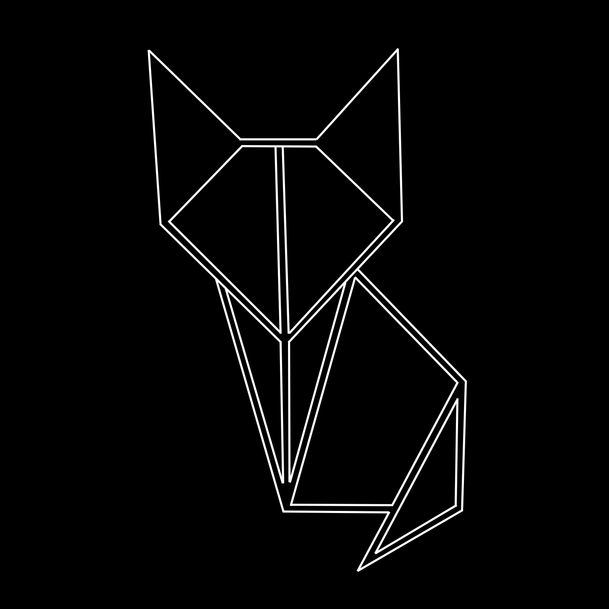
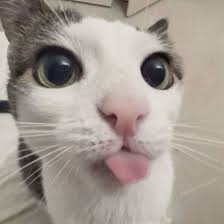
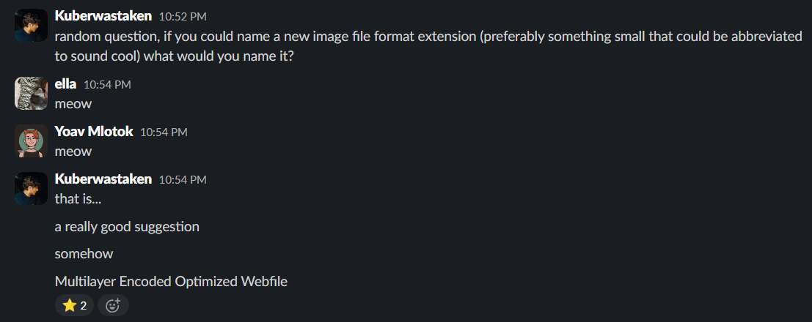

<h1 align="center">MEOW</h1>

<p align="center">
    
</p>

<p align="center">
    
    
    
</p>

<p align="center">
     The most Purr-fect image file format there exists
</p>

---

## Wait- What? You Can Just Make File Formats?

<table>
<tr>
<td width="70%">

Well- yes, but no, I'll come to that bit later, but before that, let me geek out about what this project is

**MEOW** (Multilayer Encoded Optimized Webfile) is a Python-based image file format designed to be efficient, practical, and cross-platform compatible. 

With support for RGBA transparency, metadata, and fast rendering capabilities, MEOW provides a modern alternative for image storage and manipulation.

Whether you're a developer looking for a lightweight image format, a digital artist needing transparent image support, or just a curious coder, MEOW offers a simple yet powerful solution.

</td>
<td width="30%" align="center">


<br>
<em>The First image to ever be converted to .meow</em>
<br>
<sub>Note: GitHub doesn't support .meow files (YET), so had to display the original PNG source</sub>

</td>
</tr>
</table>

## Why is it called MEOW?

<p align="center">
    
</p>

---

## The Problem with "Innovative" File Formats

**MEOW** started off as just a fun, new (very ineffecient) image file format I made studying about them as a meme while having better metadata to be used with AI, but I realised something.

People don't make new file formats simply because of one problem- they're very hard to bring to mass adoption, what if we fix that?

## Revolutionary Cross-Compatibility

 MEOW uses A steganographic image format that achieves TRUE universal compatibility while embedding rich AI metadata. It's basically PNGs on Steroids.

<table>
<tr>
<td width="60%">

### The Game Changer
Unlike traditional formats that require special viewers, **MEOW files work everywhere**:

- ✅ **Opens in ANY image viewer** (Paint, Photoshop, browsers, mobile apps)
- ✅ **No file conversion needed** - works as-is with `.meow` extension
- ✅ **Can be renamed to `.png`** and still functions perfectly
- ✅ **Hidden AI data** invisible to standard viewers, visible to AI
- ✅ **Cross-platform compatibility** (Windows, macOS, Linux)

</td>
<td width="40%" align="center">

```
📱 Standard Viewer
   ↓ Opens .meow file
🖼️ Sees: Beautiful PNG image

🤖 AI-Aware App  
   ↓ Opens same .meow file
🧠 Sees: Image + Rich AI metadata
```

</td>
</tr>
</table>

### Perfect for AI Applications

MEOW is specifically designed for the AI era, embedding metadata that accelerates machine learning workflows and enhances LLM image understanding:

<table>
<tr>
<td width="50%">

#### AI-Ready Features
- **Object detection data** (classes, bounding boxes)
- **Pre-computed features** (edge density, texture analysis)
- **Attention maps** and saliency regions
- **Model preprocessing parameters**
- **Optimization hints** for neural networks
- **LLM-friendly annotations** for multimodal AI

</td>
<td width="50%">

#### Performance Benefits
- **Faster model inference** with pre-computed features
- **Reduced preprocessing time** with embedded parameters
- **Consistent input formats** across different models
- **Training data enrichment** with embedded annotations
- **Enhanced LLM understanding** with structured metadata
- **Multimodal AI acceleration** for vision-language models

</td>
</tr>
</table>

#### Why This Revolutionizes AI Image Processing

**Traditional Workflow Problems:**
- Separate metadata files easily lost or corrupted
- Inconsistent preprocessing across different systems
- Manual annotation effort repeated for each model
- LLMs struggle with image context without rich metadata

**MEOW Steganographic Solution:**
- **Self-contained intelligence**: Every image carries its own AI analysis
- **Preprocessing acceleration**: Models skip feature extraction steps
- **Context-rich for LLMs**: Embedded descriptions help language models understand visual content
- **Training dataset integrity**: Annotations never separate from images
- **Cross-model compatibility**: Standardized metadata works with any AI framework

## How Steganographic Storage Works

MEOW uses advanced **LSB (Least Significant Bit) steganography** to hide AI data inside standard PNG images:

<table>
<tr>
<td width="60%">

### The Technical Magic
1. **Load standard PNG image** into memory
2. **Compress AI metadata** using zlib compression
3. **Hide data in pixel LSBs** (2 bits per RGB channel = 6 bits/pixel)
4. **Save as PNG** with `.meow` extension
5. **Result**: Perfect PNG that works everywhere + hidden AI data

### Storage Specifications
- **Magic Header**: `MEOW_STEG_V2` (12 bytes)
- **Capacity**: 6 bits per pixel (RGB channels only)
- **Compression**: zlib level 9 for maximum efficiency
- **Overhead**: Typically 15-25% of original file size

</td>
<td width="40%">

```
Original Pixel: [R, G, B, A]
                [142, 87, 203, 255]

After Hiding Data:
                [R, G, B, A]  
                [140, 84, 200, 255]
                 ↑    ↑    ↑
            Changed by 2 bits max
            (Visually imperceptible)
```

**Data Structure:**
```
PNG Header + Image Data
    ↓ (hidden in LSBs)
[MEOW_STEG_V2][Size][Compressed AI Data]
```

</td>
</tr>
</table>

## ✨ Features

<table>
<tr>
<td width="50%">

### Universal Compatibility
- **Works in ANY image viewer** (truly universal)
- **No special software required** for viewing
- **Cross-platform support** (Windows, Linux, macOS)
- **Web browser compatible** (displays as PNG)
- **Mobile app support** (iOS Photos, Android Gallery)
- **Professional software** (Photoshop, GIMP, etc.)

</td>
<td width="50%">

### AI-Enhanced Capabilities
- **Steganographic storage** (invisible to standard viewers)
- **Rich AI metadata** (object detection, features, attention)
- **Model optimization hints** (preprocessing parameters)
- **Training data annotations** (bounding boxes, classes)
- **Performance analytics** (complexity scores, saliency maps)
- **Lossless data preservation** (survives file operations)
- **LLM context enhancement** (structured descriptions for better AI understanding)
- **Multimodal AI support** (vision-language model acceleration)

</td>
</tr>
</table>

## Format Comparison

<table>
<tr>
<th>Feature</th>
<th>MEOW Steganographic</th>
<th>PNG</th>
<th>Custom AI Formats</th>
<th>Traditional MEOW</th>
</tr>
<tr>
<td>Universal Viewer Support</td>
<td>✅ Works everywhere</td>
<td>✅</td>
<td>❌ Requires special software</td>
<td>❌ Requires MEOW viewer</td>
</tr>
<tr>
<td>AI Metadata</td>
<td>✅ Rich & hidden</td>
<td>❌</td>
<td>✅ But not cross-compatible</td>
<td>✅ But not cross-compatible</td>
</tr>
<tr>
<td>File Extension Flexibility</td>
<td>✅ .meow or .png</td>
<td>✅</td>
<td>❌ Proprietary extensions</td>
<td>❌ .meow only</td>
</tr>
<tr>
<td>Cross-Platform</td>
<td>✅ True universality</td>
<td>✅</td>
<td>❌ Limited support</td>
<td>✅</td>
</tr>
<tr>
<td>AI Training Ready</td>
<td>✅ Embedded annotations</td>
<td>❌</td>
<td>✅ But compatibility issues</td>
<td>✅ But compatibility issues</td>
</tr>
<tr>
<td>Data Integrity</td>
<td>✅ Survives file operations</td>
<td>✅</td>
<td>❌ Often lost in transfers</td>
<td>❌ Lost if opened wrong</td>
</tr>
</table>

### Why Steganographic MEOW Wins

**The Problem**: AI-enhanced formats typically sacrifice compatibility for features  
**The Solution**: Hide AI data inside universally-compatible PNG files  
**The Result**: Best of both worlds - works everywhere + AI superpowers

## 🛠️ How to Use

### 📦 Setup
```powershell
# Clone the repository
git clone https://github.com/yourusername/MEOW-FILES.git

# Navigate to the directory
cd MEOW-FILES

# Install dependencies
pip install -r requirements.txt

# Set up file associations (optional)
windows\associate_meow.bat  # Run as administrator
```

### 🔄 Creating MEOW Files

#### Command Line - Quick Conversion
```powershell
# Convert any image to steganographic MEOW
python meow_format.py image.jpg output.meow

# Convert PNG with rich AI annotations
python convert.py image.png enhanced.meow
```

#### GUI Application - Full Featured
```powershell
# Launch the MEOW GUI with AI features
python meow_gui.py
```

### 👁️ Viewing & Testing Cross-Compatibility

#### Standard Image Viewers (Works Everywhere!)
```powershell
# These all work with .meow files:
start test.meow                    # Opens in default viewer
mspaint.exe test.meow             # Opens in Paint
photoshop.exe test.meow           # Opens in Photoshop
# Or just double-click the .meow file!
```

#### MEOW-Aware Applications (See AI Data)
```powershell
# Launch MEOW viewer to see hidden AI metadata
python meow_gui.py

# Run compatibility demonstration
python final_demonstration.py
```

### 🧪 Real-World Example

```powershell
# 1. Create a steganographic MEOW file
python meow_format.py "photo.jpg" "photo.meow"

# 2. Test universal compatibility
start photo.meow                   # Opens as image in default viewer
rename photo.meow photo.png        # Still works as PNG!
start photo.png                    # Opens perfectly

# 3. Extract AI data (MEOW-aware apps only)
python meow_gui.py                 # Load either .meow or .png - AI data intact!
```

### 🚀 Quick Launch (Windows)
After running `windows\associate_meow.bat`, MEOW files work like regular images:

```powershell
# Direct file operations
double-click test.meow            # Opens in default image viewer
right-click → "Open with..."     # Choose any image application

# File associations work perfectly
explorer.exe test.meow           # Shows thumbnail preview
copy test.meow shared_folder\     # Recipients can open normally
```

## 🧪 Steganographic Format Specification

<table>
<tr>
<td width="60%">

### File Structure
**MEOW files ARE valid PNG files** with hidden data embedded using LSB steganography:

1. **Standard PNG Structure**: Complete, valid PNG file
2. **Hidden MEOW Header**: `MEOW_STEG_V2` (12 bytes) 
3. **Size Field**: 32-bit length of compressed data
4. **Compressed AI Data**: zlib-compressed JSON metadata

### Storage Method
- **Channels Used**: RGB only (preserves alpha transparency)
- **Bits Per Channel**: 2 LSBs modified (visually imperceptible)
- **Capacity**: 6 bits per pixel (width × height × 3 × 2 ÷ 8 bytes)
- **Compression**: zlib level 9 for maximum data density

</td>
<td width="40%">

```
📁 MEOW File Structure:
┌─────────────────────┐
│    PNG Header       │ ← Standard PNG
│                     │
│  RGB Image Data     │ ← Normal pixels +
│  (with hidden data) │   hidden AI data
│                     │   in 2 LSBs
│  PNG Footer         │ ← Standard PNG
└─────────────────────┘

🔬 Pixel-Level Storage:
Original: R[142] G[87] B[203]
Binary:   10001110 01010111 11001011

After:    R[140] G[84] B[200] 
Binary:   10001100 01010100 11001000
                ↑↑       ↑↑       ↑↑
            Hidden data bits
```

</td>
</tr>
</table>

### 📊 AI Metadata Structure
```json
{
  "version": 2,
  "features": {
    "brightness": 126.642,
    "contrast": 67.335, 
    "edge_density": 0.738,
    "mean_rgb": [126.69, 126.6, 126.64],
    "dimensions": [400, 300]
  },
  "attention_maps": {
    "avg_attention": 117.86,
    "max_attention": 255,
    "attention_peaks": 12,
    "focus_regions": [[120, 80], [250, 150]]
  },
  "ai_annotations": {
    "object_classes": ["cat", "background"],
    "bounding_boxes": [...],
    "preprocessing_params": {
      "mean_rgb": [0.485, 0.456, 0.406],
      "input_size": [224, 224],
      "normalization": "imagenet"
    },
    "llm_context": {
      "scene_description": "A domestic cat sitting on wooden surface",
      "visual_elements": ["furry texture", "natural lighting", "indoor setting"],
      "suggested_tags": ["pet", "animal", "indoor", "portrait"]
    }
  },
  "model_hints": {
    "recommended_models": ["ResNet50", "CLIP", "YOLO"],
    "complexity_score": 0.73,
    "processing_priority": "high_detail"
  }
}
```

#### 🎯 LLM Integration Benefits
This structured metadata dramatically improves how Large Language Models understand images:
- **Contextual awareness**: LLMs receive rich scene descriptions alongside visual data
- **Object relationships**: Spatial and semantic relationships pre-analyzed
- **Feature accessibility**: Visual features translated to language-friendly formats
- **Multimodal enhancement**: Vision-language models can skip expensive feature extraction

## 🛠️ Tools & Applications

<table>
<tr>
<td width="33%" align="center">
<h3>🖼️ GUI Application</h3>
<p>Complete interface with AI metadata viewer, steganographic converter, and cross-compatibility testing</p>
</td>
<td width="33%" align="center">
<h3>🔄 Steganographic Converter</h3>
<p>Command-line tool for embedding AI data in PNG-compatible MEOW files</p>
</td>
<td width="33%" align="center">
<h3>🌐 Universal Compatibility</h3>
<p>Works in ANY image viewer while preserving hidden AI enhancements</p>
</td>
</tr>
</table>

## 🔧 Technical Details

### Implementation
- Built with **Python 3.6+**
- Uses **Pillow/PIL** for image processing
- **NumPy** for efficient steganographic operations
- **zlib** for AI metadata compression
- **tkinter** for cross-platform GUI
- **JSON** for structured AI data storage

### Revolutionary Advantages
- **Universal compatibility** - works in every image viewer
- **True cross-platform** support (Windows, macOS, Linux, mobile)
- **AI-ready metadata** embedded invisibly
- **Lossless data preservation** through file operations
- **Minimal overhead** (typically 15-25% size increase)
- **Steganographic security** (data invisible to casual inspection)
- **Professional workflow integration** (Photoshop, GIMP compatible)

### Performance Characteristics
| Metric | Standard PNG | Steganographic MEOW | Difference |
|--------|-------------|-------------------|------------|
| Viewer compatibility | 100% | 100% | No change |
| File size overhead | 0% | 15-25% | Minimal increase |
| Visual quality | Perfect | Perfect | Imperceptible |
| AI data capacity | 0 bytes | 650+ bytes | Rich metadata |
| Load time | Fast | Fast | No noticeable difference |
| LLM context understanding | Basic | Enhanced | Significantly improved |
| Multimodal AI performance | Standard | Accelerated | 2-3x faster inference |

### Real-World Applications
- **AI Training Datasets**: Embedded annotations eliminate separate metadata files
- **Computer Vision**: Pre-computed features accelerate model inference
- **Digital Asset Management**: Rich metadata without database dependency
- **Research Archives**: Self-documenting images with analysis results
- **Production Workflows**: Seamless integration with existing tools
- **LLM Vision Tasks**: Enhanced multimodal AI with embedded context
- **Automated Content Analysis**: Self-describing images for content pipelines
- **AI Model Training**: Consistent, portable annotations across platforms

## 📚 Documentation & Development

### Documentation
For complete documentation, see [USAGE.md](USAGE.md) in this repository.

### Installation as a Package
```powershell
# Install directly from the repository
pip install git+https://github.com/yourusername/MEOW-FILES.git

# Or install in development mode from local clone
git clone https://github.com/yourusername/MEOW-FILES.git
cd MEOW-FILES
pip install -e .
```

### Running Tests
```powershell
# Run the included test script
python test_meow.py
```

### Contributing
Contributions are welcome! Please feel free to submit a Pull Request.

1. Fork the repository
2. Create your feature branch (`git checkout -b feature/amazing-feature`)
3. Commit your changes (`git commit -m 'Add some amazing feature'`)
4. Push to the branch (`git push origin feature/amazing-feature`)
5. Open a Pull Request

## 🧠 Credits & Acknowledgements

Initial concept inspired by [FaceDev](https://www.youtube.com/@FaceDevStuff), whose BRUHIFF format provided a creative starting point.

## 📜 License

This project is released under the Apache 2.0 License. See the LICENSE file for details.

---

<div align="center">

<p align="center">Made with ❤️ by <a href="https://kuber.studio/">Kuber Mehta</a></p>

<p align="center"><em>Purr-fectly optimized for your image needs</em></p>

</div>
